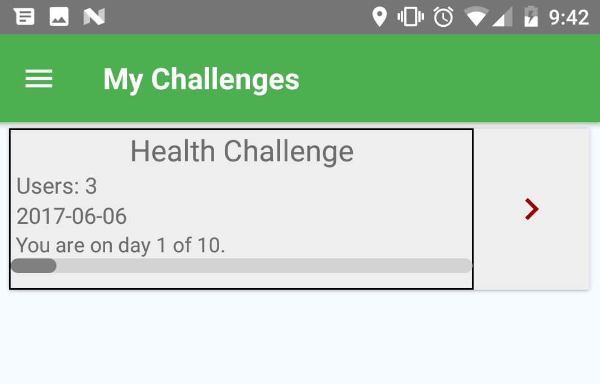
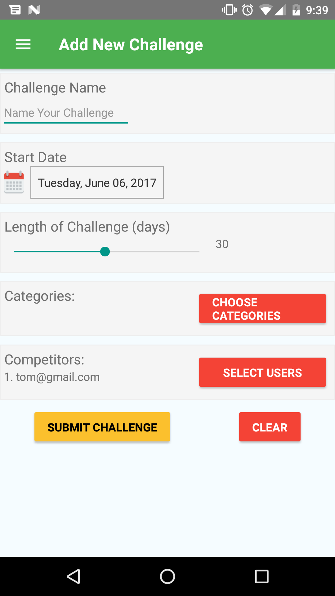
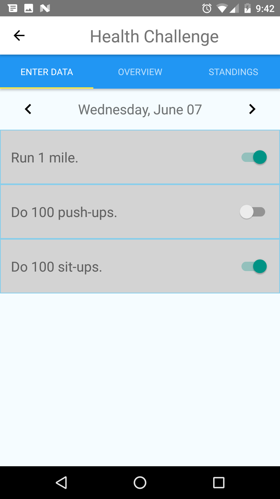
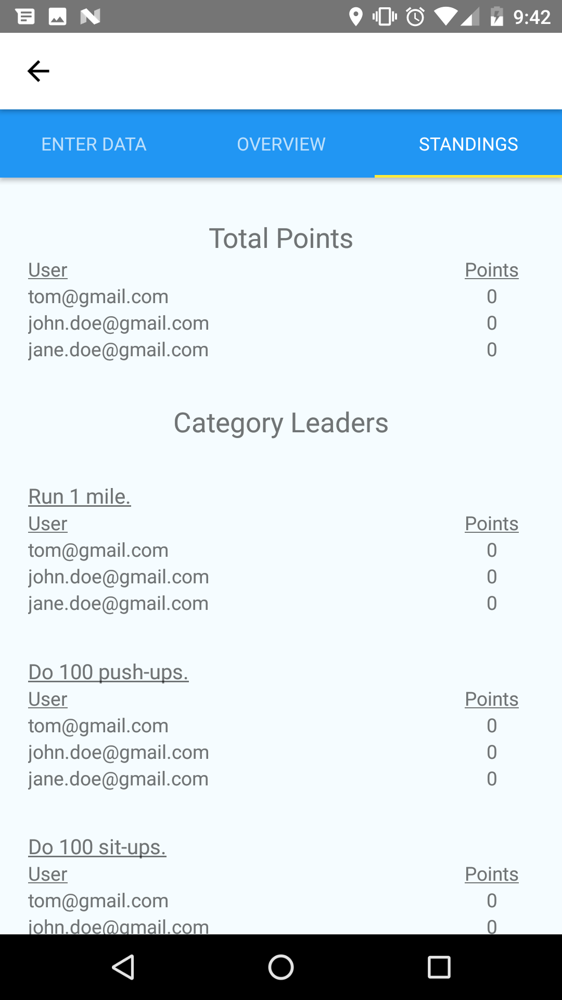

#  Team Challenge
Mobile app built with React Native that allows groups of people to create and track challenge benchmarks. Utilizes Firebase for authentication and syncing data in real time.

<strong>[Android Play Store](https://play.google.com/store/apps/details?id=com.delisauce.teamchallenge) </strong> 
<strong>Apple App Store</strong> (pending)

###### Sample challenge: Fitness Challenge
- 5 people, 30 days, 10 categories
- receive 1 point per day for each category completed
- person with the most points is the winner

<!-- 

 -->

#### New Challenges

 Users can create a new challenge and it is instantly added to each user's "My Challenges" page. Incorporates dynamic Firebase database user search in conjunction with data from user contacts.

  
  
  

#### Challenge Status Data
There are 3 screens for each challenge:
- Enter Data: allows the user to select completed goals for any given day
- Overview: provides a view of the individual user's accumulated points
- Standings: provides a large picture view of how each user's points stack up against each other 

  
  

### Firebase
- Provides user authentication.
- Utilizes realtime database to update information for all users when changes are made.
- NoSQL as opposed to a relational database. Data is stored in a JSON tree.

      Firebase Database Model:
      {
        users: {
          "user_0001": {
            name: "John Doe",
            email: "JohnDoe@gmail.com",
            id: "user_0001",
            photo: "www.photo1.com",           
            provider: "facebook.com",
            contacts: { ... },
            challenges: {
              "challenge_001": {
                name: "Workout Challenge",
                adminID: "user_0001",
                days: "30",
                startDate: "2017-06-22"
              },
              "challenge_0002": {
                ...
              }
            }
          },
          Jane: { ... }
        },

        //indexed on email
        userLookup: {
          "user_0001": {
            name: "John Doe",
            email: "JohnDoe@gmail.com",
            photo: "www.photo1.com",
            provider: "facebook.com"
          },
          "user_0002": { ... }
        },

        challenges: {
          "challenge_0001": {
            name: "Workout Challenge",
            admin: "user_0001",
            days: "30"
            startDate: "2017-06-22",
            categories: {
              0: "60 sit-ups",
              1: "walk to work",
              ...
            }
            competitors: {
              0: {
                email: "JohnDoe@gmail.com",
                id: "user_0001"
                },
              1: {
                email: "JaneDoe@gmail.com",
                id: "user_0002"
                }
              ...
            },
            userData: {
              "user_0001": {
                [[false, true, true],
                 [true, true, true],
                 [false, false, false]]
              },
              "user_0002": {
                [[true, true, true],
                 [true, true, false],
                 [false, true, true]]
              }
            }
          },
          "challenge_0002": { ... }
        }
      }

### Future goals
- Add Firebase notifications (updates regarding leaders, new challenges, etc).
  - this may require a iOS developer account...Android may be simpler
- "Beautify" challenge overview information and standings.
  - look into graphing modules for react native
- Make user search more robust.
  - include option to email non-users with a link to the app in the Play store.

### Other Important Information
[Task List Items (completed and pending)](docs/task_list.md)
 
[Setup and Installation](docs/installation_instructions.md)
 
[Privacy Policy](docs/privacy_policy.md)
